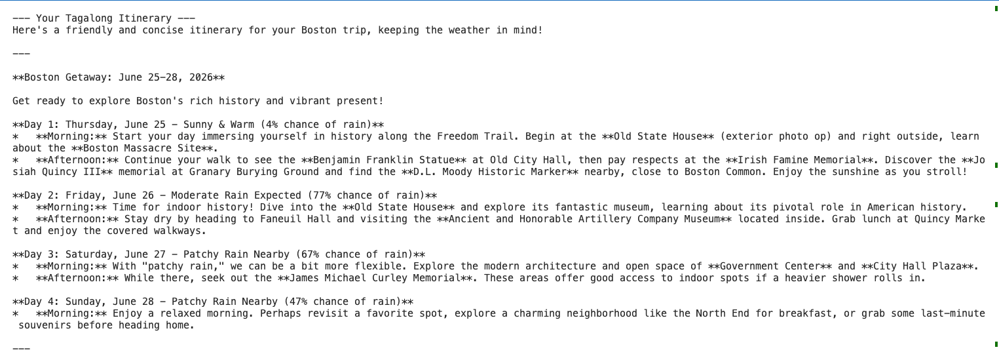

#  :airplane: TagAlong

TagAlong is a personalized travel planning application that generates day-by-day itineraries tailored to a user's destination, travel dates, and preferences. by integrating weather forecasts, local attractions, and AI-powered recommendations, TagAlong helps travelers spend less time planning and more time exploring.

---------

## Features

    - Generate personalized day-by-day travel itineraries
    - Discover attraction, restaurants, events, and activities using external APIs
    - Incorporate real-time weather forecasts into itinerary recommendations
    - Store and manage trip information using a SQLite database

---------

## How To Use

### User Input

### Weather and Attraction Retrieval 

### Generated Itinerary

## Technologies Used

- Python3
- SQLite 
- [Weather API](https://www.weatherapi.com)
- [Geoapify API](https://www.geoapify.com/)
- [Google Gemini API](https://ai.google.dev/gemini-api/docs)

## Contact

For questions, suggestyions, or collaborative opportunities, please contact:

### Eva King-Senior
- Email: [evakingsr@gmail.com](evakingsr@gmail.com)
- GitHub : [evakingsr](https://github.com/evakingsr)

### Malek Aloulou
- Email: [aloulou@bc.edu](aloulout@bc.edu)
- GitHub: [aloulou-dev](https://github.com/aloulou-dev)

    